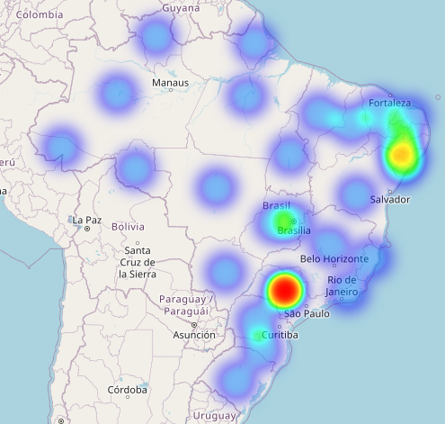

# Alura-Store

## 📊 Análise de Desempenho Financeiro — Python

Este projeto é uma análise de indicadores como faturamento, avaliação dos clientes, frete e localidade desenvolvida com Python, com o objetivo de analisar o desempenho de vendas de uma empresa fictícia, que possui 4 filiais e deseja cessar as atividades de uma delas para focar os investimentos em outra área.  
A solução visa demonstrar habilidades em modelagem de dados, análise com Python, além de boas práticas para facilitar a visualização do usuário.

---

## 🎯 Objetivos do Projeto

- Consolidar aprendizados em Python e suas bibliotecas.
- Criar uma visão gerencial de vendas segmentada por faturamento, geolocalização, frete e tendências de venda.
- Simular uma aplicação real de Business Intelligence voltada para a área comercial.

---

## 🛠️ Ferramentas Utilizadas

- Python
- Pandas
- Matplotlib
- Folium (para mapeamento)
- Google Colab (ambiente de desenvolvimento)

---

## 📈 Principais Análises Realizadas

- Comparação de faturamento entre as lojas no último ano.
- Análise de categorias de produtos mais e menos vendidos.
- Média de avaliações de clientes por loja.
- Análise do custo médio de frete por loja.
- Mapeamento geográfico das vendas.
- Identificação de pontos fortes e fracos para auxiliar na decisão estratégica de encerramento de uma filial.

  .Mapa de calor das vendas da Loja 3.

---

## 🛤️ Melhorias Futuras

- **Implementação de um Dashboard Interativo em Power BI:**  
  Desenvolver um painel dinâmico que complemente a análise em Python, permitindo uma visualização mais amigável e gerencial dos indicadores de desempenho.

---

## 📋 Conclusão

Com base nas análises, foi identificado que a Loja 3 apresenta o pior desempenho financeiro, mesmo mantendo uma boa avaliação dos clientes. A recomendação é reavaliar o investimento nessa unidade e considerar seu encerramento para otimizar os resultados da empresa.

---

## 🚀 Como Executar

1. Clone o repositório
2. Abra o notebook no Google Colab ou ambiente Jupyter de sua preferência
3. Instale as dependências necessárias
4. Execute as células para visualizar as análises e gráficos
